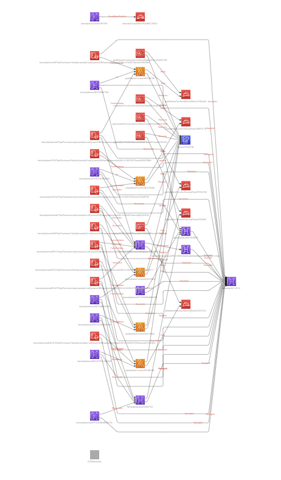
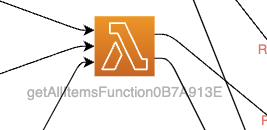
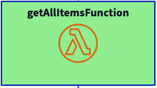
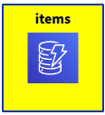
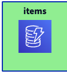
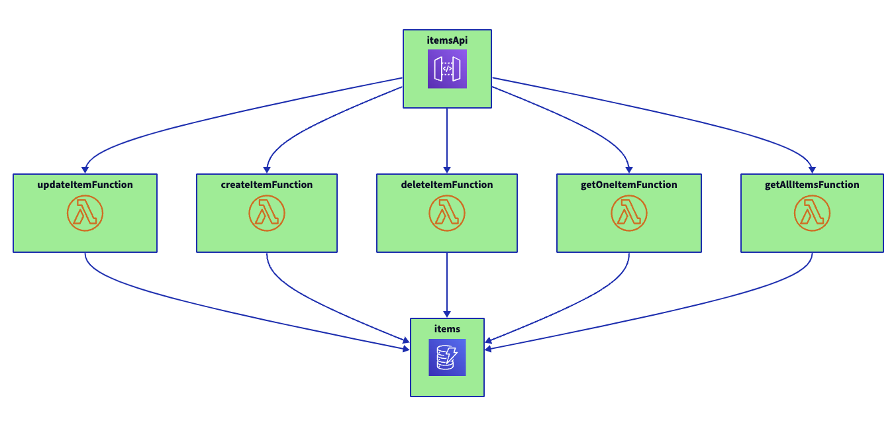
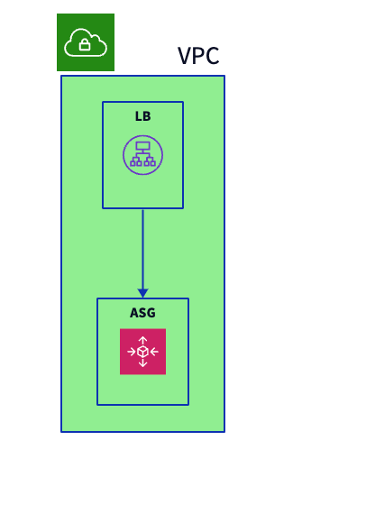
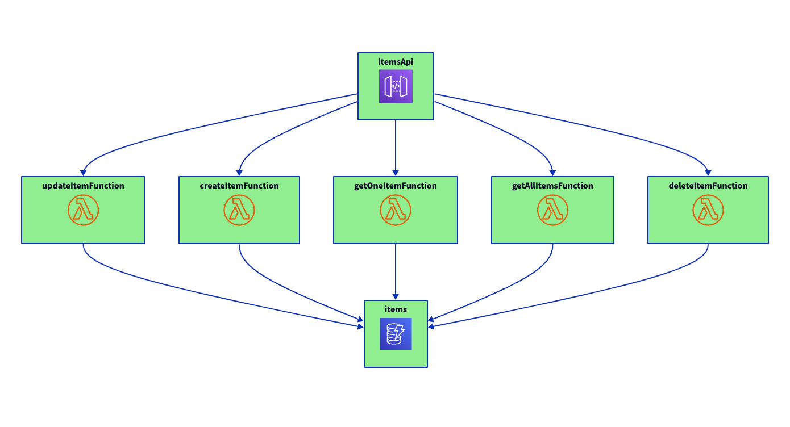
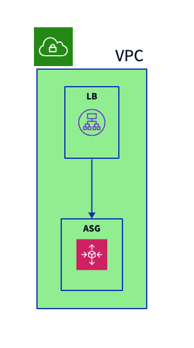
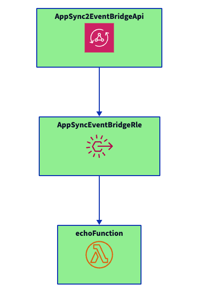

# Drawing CloudFormation events with D2


A diagram shows gives an overview about architectures and should be created for every project.
Often the question is "can a diagram be generated automatically"?

There are tools like [cfn-dia](https://github.com/mhlabs/cfn-diagram) which generate diagrams out of a CloudFormation template.

The problem with those tools is that the diagram includes *all* resources.

Let`s take an [api](https://github.com/aws-samples/aws-cdk-examples/tree/master/typescript/api-cors-lambda-crud-dynamodb) example from the aws cdk examples.

The auto-generated whole diagram would look like this:




## Problems

There are these problems with that diagram:

### 1) Noise

The obvious problem, that you get no insights into the architecture, there is to much noise

### 2) Technical labels

The resources are labeled with the CloudFormation *logical* ID, like `getAllFunctions07A913E`




### 3) Statical view

You get the defined CloudFormation text file, but you do not get the information, whether the resource is deployed or not.

## Solution

### 1) Remove Noise

Instead of drawing *all* resources, you decide which constructs are show.
During development you add the information **Show** in the CDK app to the code:

```ts
    const getAllLambda = new NodejsFunction(this, 'getAllItemsFunction', {
      entry: join(__dirname, 'lambdas', 'get-all.ts'),
      ...nodeJsFunctionProps,
    });
    d2.show(getAllLambda)
```

To keep the diagram simple, you only have three metadata types:

- **Show** to add constructs to the diagram
- **Connection** to add connections between constructs
- **Container** to indicate that a Construct contains another Construct like in a VPC

### 2) Use business domain labels

To show labels from the business domain, you could display the **construct ID**. So the `getAllLambda` gets the label `getAllItemsFunction` instead of `getAllFunctions07A913E`.

So the Function appears as:



### 3) Show deployment state

CloudFormation creates resources. While the creation is in progress, the resource is shown with yellow background:



If the creation is complete the backgroud is green:




- Only Constructs are shown.
    e.g. "/adotstarter-auto/adotstarter-ts/ServiceRole" is not shown

## Creating a meaningfull diagram

So adding those lines to the `api-cors-lambda-crud-dynamodb` example:

### Show main Resources

```ts
    d2.show(dynamoTable)
    d2.show(getOneLambda)
    d2.show(getAllLambda)
    d2.show(createOneLambda)
    d2.show(updateOneLambda)
    d2.show(deleteOneLambda)
    d2.show(api)
```

### Show connections

API to lambda

```ts
    d2.Connection(api,getOneLambda)
    d2.Connection(api,getAllLambda)
    d2.Connection(api,createOneLambda)
    d2.Connection(api,updateOneLambda)
    d2.Connection(api,deleteOneLambda)
```

Lambdas to table
```ts
    d2.Connection(getAllLambda,dynamoTable)
    d2.Connection(getOneLambda,dynamoTable)
    d2.Connection(createOneLambda,dynamoTable)
    d2.Connection(updateOneLambda,dynamoTable)
    d2.Connection(deleteOneLambda,dynamoTable)
```

### Result



## Usage

### Visibility

Resources are only drawn if `Show` is set `true`

#### TypeScript

```ts
resource.node.addMetadata("Show", "true")
```

#### GO

```go
resource.Node().AddMetadata(aws.String("Show"), aws.String("true"),nil)
```


#### Python

```py
auto_scaling_group.node.add_metadata("Show","true")
```

### Connections

#### TypeScript

```ts
resource.node.addMetadata("Connection", otherResource.node.id)
```

#### GO

```go
resource.Node().AddMetadata(aws.String("Connection"), otherResource.Node().Id(),nil)
```

#### Python

```py
lb.node.add_metadata("Dependency", auto_scaling_group.node.id)
```



### Container

#### TypeScript

```ts
resource.node.addMetadata("Container", otherResource.node.id)
```

#### GO

```go
monolithSG.Node().AddMetadata(aws.String("Container"), vpc.Node().Id(),nil)
```

#### Python

```py
auto_scaling_group.node.add_metadata("Container",vpc.node.id)
```

## Libraries

Add the files to your CDK project.

### Typescript

See `testdata/lib-ts`

```ts
import d2 = require("../lib/d2");
```

### Go

See `testdata/lib-go`

```go
import "d2"
```
## Gallery

### Serverless API

Source: aws-cdk-examples/typescript/api-cors-lambda-crud-dynamodb/



Added:

```ts
import d2 = require("./d2");
d2.show(dynamoTable)
d2.show(getOneLambda)
d2.show(getAllLambda)
d2.show(createOneLambda)
d2.show(updateOneLambda)
d2.show(deleteOneLambda)
d2.Connection(getAllLambda,dynamoTable)
d2.Connection(getOneLambda,dynamoTable)
d2.Connection(createOneLambda,dynamoTable)
d2.Connection(updateOneLambda,dynamoTable)
d2.Connection(deleteOneLambda,dynamoTable)
d2.show(api)
d2.Connection(api,getOneLambda)
d2.Connection(api,getAllLambda)
d2.Connection(api,createOneLambda)
d2.Connection(api,updateOneLambda)
d2.Connection(api,deleteOneLambda)
```

### Load Balancer / VPC

Source:
aws-cdk-examples/typescript/application-load-balancer/



Added:

```ts
import d2 = require("./d2");
d2.show(vpc)
d2.show(asg)
d2.Container( asg,vpc)
d2.show(lb)
d2.Container(lb,vpc)
d2.Connection(lb,asg)
```

### AppSync GraphQL sending events to Event Bridge

Source:

aws-cdk-examples/typescript/appsync-graphql-eventbridge



Added:

```ts
import d2 = require("./d2");
d2.Show(appSync2EventBridgeGraphQLApi)
d2.Show(echoLambda)
d2.Show(rule)
d2.Connection(rule,echoLambda)
d2.Connection(appSync2EventBridgeGraphQLApi,rule)
```
